# 📱 My Reminder – Android App  

A smart, user-friendly Android application that helps users manage their time, money, and daily tasks efficiently through reminders, trackers, and productivity tools.  

---

## 🧩 Problem Statement  
Nowadays, most people waste valuable time on social media and other distractions.  
Even those who want to improve their habits often fail due to a lack of proper management and determination.  

Our young generation, in particular, faces several challenges such as:  
- ⏰ Poor time management  
- 💭 Forgetfulness  
- 💸 Financial mismanagement  
- 📦 Disorganization  
- 📉 Decreased productivity  

---

## 💡 Solution  
To solve these problems, we developed **“My Reminder”**, an Android app that helps users plan, track, and organize their daily lives.  
The app integrates multiple tools like a reminder system, expense tracker, GPS tracking and task manager — helping users become more productive and disciplined.

---

## 🚀 Features  

### 🕒 1. Timer  
- Track time for specific tasks or short activities (e.g., cooking, studying, exercising).  
- Set time-based reminders.  
- Improve productivity through time discipline.
- 

### ⏱️ 2. Stopwatch  
- Measure the duration of activities accurately.  
- Perfect for workouts, study sessions, and time-bound challenges.
- 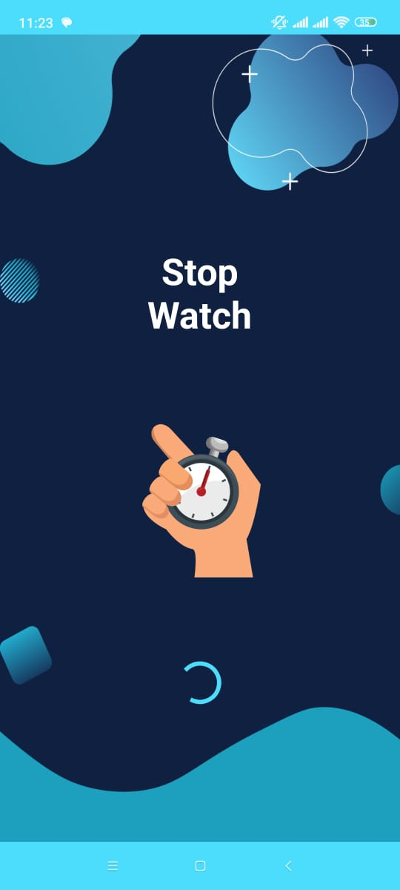

### 📝 3. To-Do List  
- Add, edit, and delete tasks easily.  
- Mark completed tasks to stay motivated.  
- Keep daily priorities organized.
-  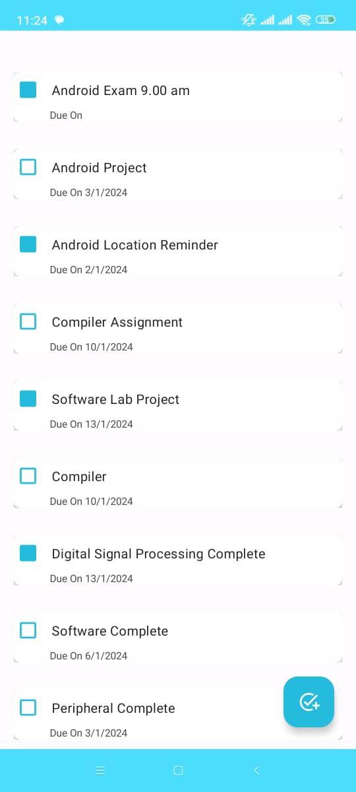

### 💰 4. My Expense Tracker  
- Manage income and expenses effectively.  
- Categorize spending for better financial control.  
- View daily, weekly, or monthly summaries.
-  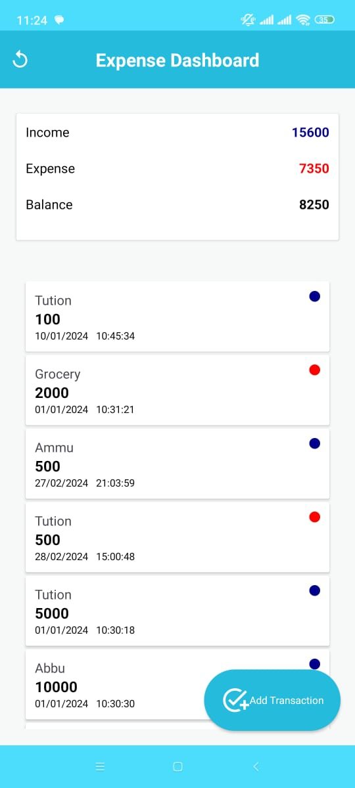  

### 🔔 5. Task Reminder  
- Get notifications for upcoming tasks.  
- Customize reminders by time and date.  
- Stay consistent with personal and professional schedules.
-  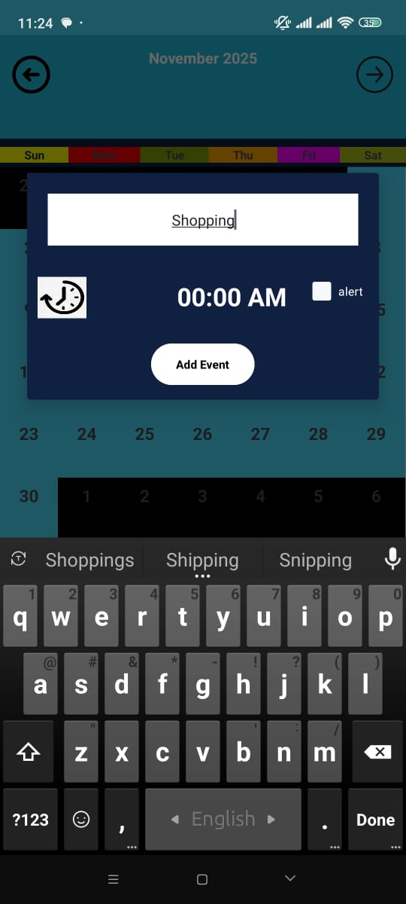  

### 📍 6. Location Reminder  
- Set reminders based on specific locations.  
- Example: “Buy groceries when near the supermarket.”  
- Uses GPS for smart, location-aware alerts.  
-  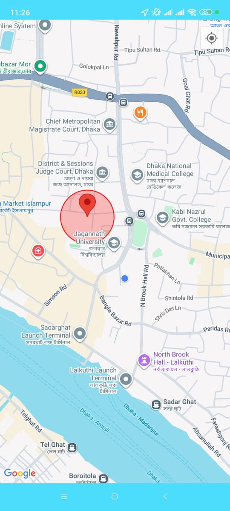
  
### 🛰️ 7. GPS Tracking System  
- Track real-time user location safely.  
- Supports location-based reminders and insights.  
- Integrated with **Google Maps API**.  
-  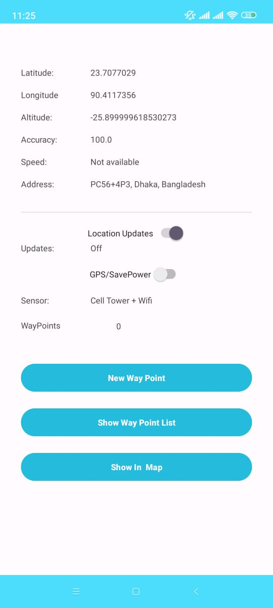
  
### 🗒️ 8. Notepad  
- Quickly write and save notes anytime.  
- Ideal for jotting down ideas, reminders, or thoughts.  
-  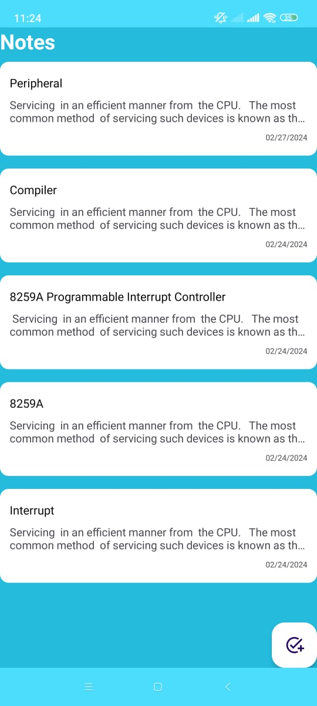

### 🗒️ 9. Navigation   
-  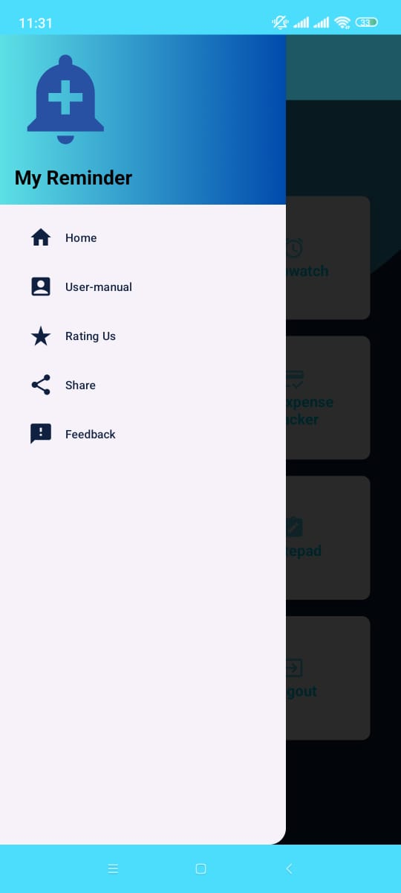

### 🗒️ 9. Register  
-  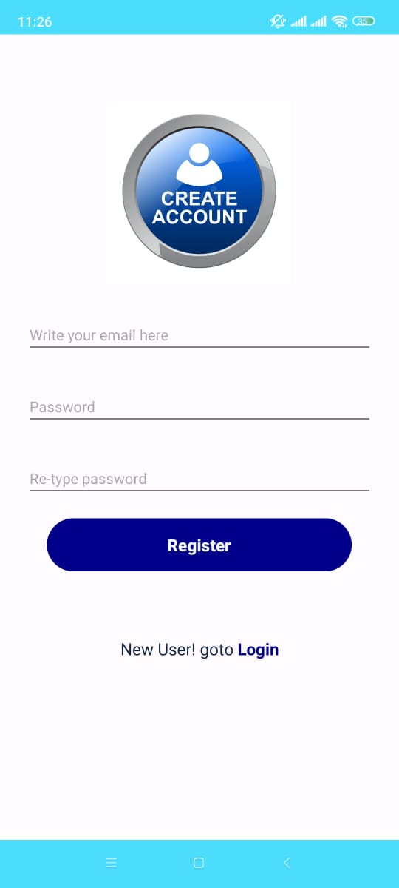
## 🗒️ 9. Login   
-  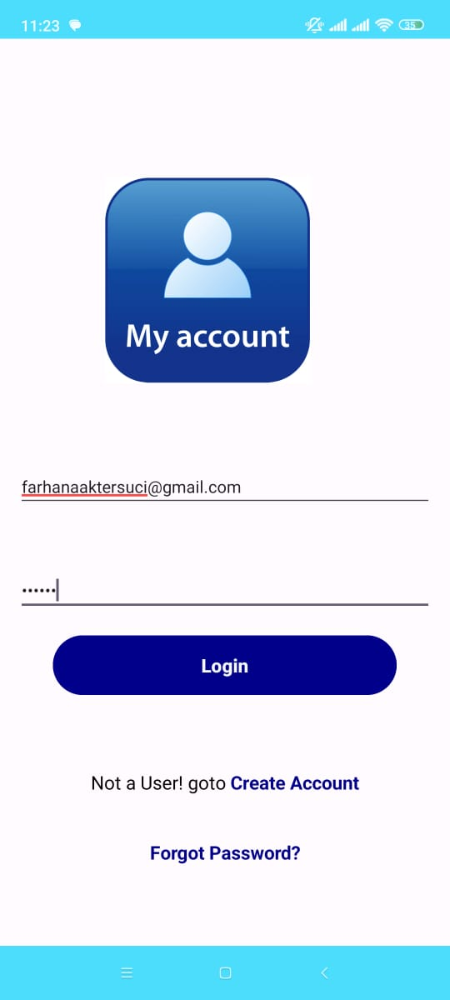
## 🗒️ 9. Forgot Password   
-  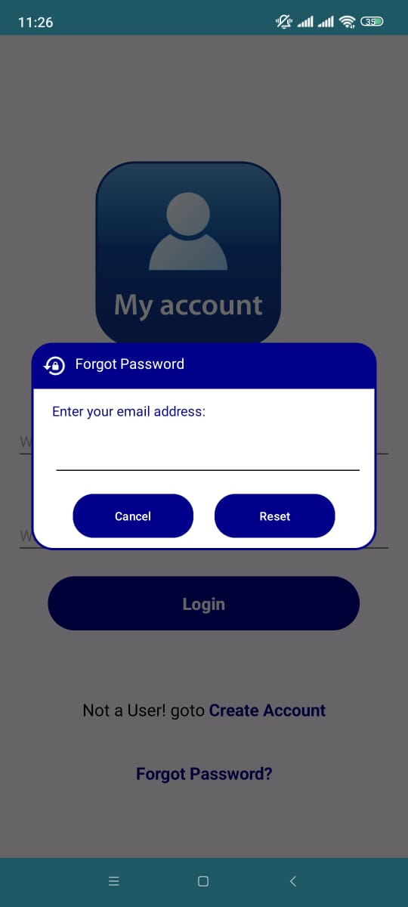

## 🗒️ 9. HomePage
-  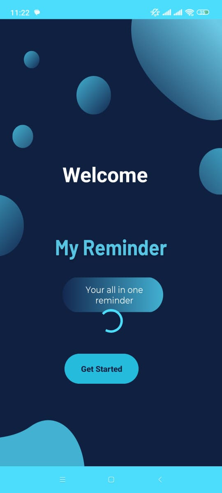

## 🗒️ 9. DashBoard   
-  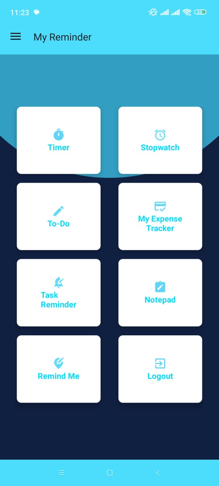
---

## 🛠️ Tools & Technologies  

### 🖥️ Software Requirements  
| Component | Technology |
|------------|-------------|
| **Frontend** | Android Studio (XML) |
| **Backend** | Java |
| **Database** | Firebase Realtime Database |
| **API Keys** | Google Maps API |
| **Operating System** | Android OS |

### 💻 Hardware Requirements  
| Component | Specification |
|------------|---------------|
| **CPU Architecture** | ARM / ARM64 |
| **RAM** | Minimum 1 GB |

---

## 🧭 Project Architecture  
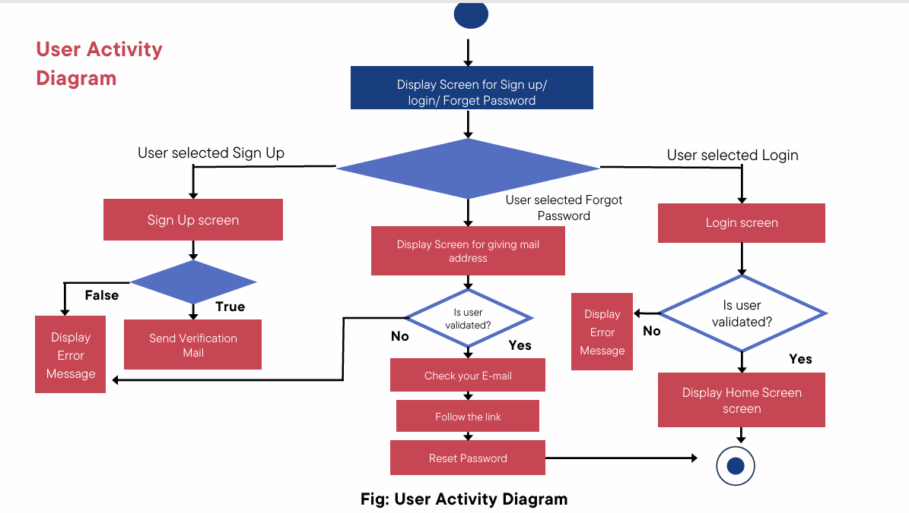
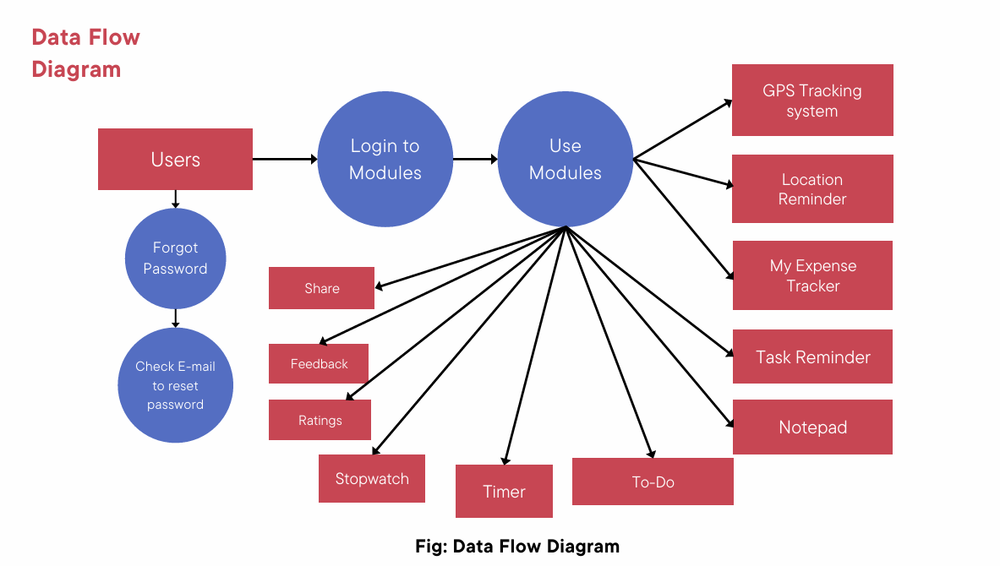

## To explore full project , please check the Project Video
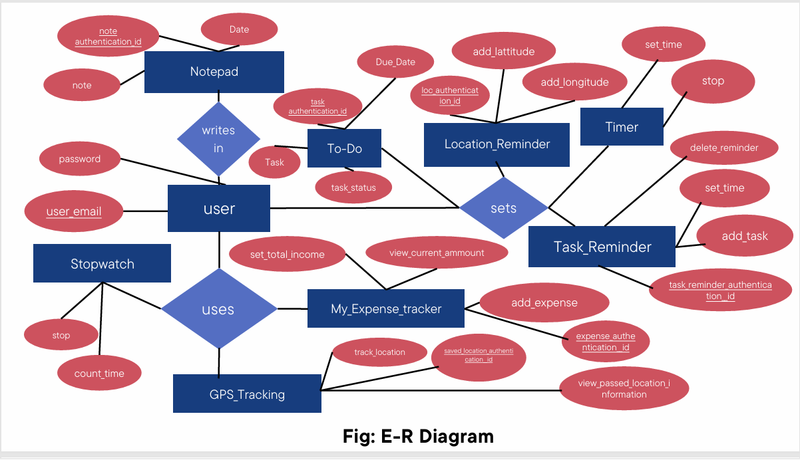
---

---
